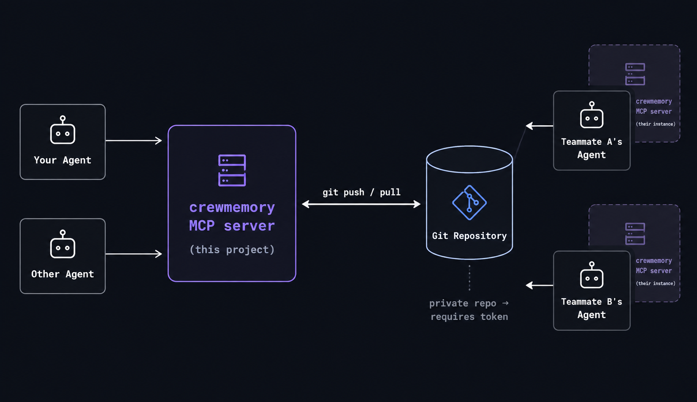

<p align="center">
  
  <br>
  <strong style="font-size: 64px; display: block; text-align: center; margin-top: 15px;">Crew Memory</strong>
</p>

**One shared memory for every AI coding agent on your team** — Claude Code, Codex, Cursor,
Gemini CLI, opencode, Windsurf, Claude Desktop, or any MCP client.

Memory lives in a git repo you own (GitHub or any git host). Every save is automatically
committed and pushed; every read pulls the latest first. When your teammate's agent logs a fix,
a decision, or what it's working on — your agent knows seconds later.

No server to run. No cloud database. No lock-in: it's plain markdown + git.



---

## Install

### One command (after the package is published)

```bash
uvx --from crewmemory-mcp crewmemory install codex --repo https://github.com/org/crewmemory.git --user alice --launcher uvx
```

Replace `codex` with `claude-code`, `claude-desktop`, `cursor`, `gemini`, `opencode`, or
`windsurf`. The same command works on Windows, macOS, and Linux when `uv` is installed.
Restart the client after registration.

For a private memory repo, also pass `--token <fine-grained-token>`; use a token limited to that
repository with Contents read/write access.

### Install from a source checkout

```bash
uv venv .venv
uv pip install --python .venv/bin/python -e .
.venv/bin/crewmemory install codex --repo https://github.com/org/crewmemory.git --user alice
```

On Windows, the executable is `.venv\Scripts\crewmemory.exe`.

Supported clients: `claude-code`, `claude-desktop`, `codex`, `cursor`, `gemini`, `opencode`,
`windsurf`. The installer backs up and merges existing config, is idempotent, and saves a private
local connection profile so `crewmemory doctor` and `crewmemory ui` work outside the agent.

### Or just ask your AI

Paste this to the agent running in this folder:

> Install yourself as a crewmemory MCP server for Claude Code. My memory repo is
> https://github.com/org/crewmemory.git, my name is alice, token is github_pat_xxx.

The agent runs `crewmemory install claude-code ...` for you. No manual tool calls needed.

### Project detection

At session start the MCP instructions tell the agent to call
`team_context(project_path="<absolute workspace root>")`. This selects the current Git repository
and branch dynamically, so one global MCP installation works across projects. `crewmemory init`
is optional and records a project in the local registry for humans and diagnostics.

```bash
crewmemory init            # registers the project; reads branch/git identity
```

### Verify anytime

```bash
crewmemory doctor          # config, connectivity, project detection, counts
```

---

## Human dashboard (no agent needed)

```bash
crewmemory ui              # opens http://127.0.0.1:8765 in your browser
crewmemory ui --port 9000 --no-browser
```

A local web dashboard for the whole team — see everything without asking an agent:

- **Team now** — who is working on what right now, progress bars, ⛔ blockers, stale badges
- **Activity** — full timeline: every note/decision/solution/status/deletion by everyone
- **Memories** — browse & search all six types, filter by author/kind, expand full text
- **Profiles** — member roles, timezones, git identities
- **Overview** — counts by type/author/project/lifecycle + storage info

Read-only, binds to 127.0.0.1 only, auto-refreshes every 30s. Zero extra dependencies.

## Windows

Fully supported:

```powershell
uv venv .venv-win
uv pip install --python .\.venv-win\Scripts\python.exe -e .
.\.venv-win\Scripts\crewmemory.exe install claude-code --repo ... --user alice --token ...
.\.venv-win\Scripts\crewmemory.exe ui
```

Member names are sanitized into safe filenames on every platform (`_member_filename`),
Codex TOML values are properly escaped for Windows paths/backslashes/quotes, and all git
calls run with `GIT_TERMINAL_PROMPT=0` so nothing hangs waiting for input.

---

## What your agents can do (tools)

| Area | Tools |
|---|---|
| **Session** | `team_context` (start-here briefing), MCP prompts `session_start` / `session_end` / `pr_review_flow` |
| **Smart retrieval** | `recall` — ranked by relevance × recency × confidence, packed into a context budget; searches team + personal scopes |
| **Raw search** | `search_memory` (filters: kind/tags/author/file/project), `list_recent`, `memory_stats` (auto index), `recent_activity` |
| **Save knowledge** | `save_note`, `log_decision` (context+decision+rationale), `log_solution` (problem/error/fix), `save_gotcha`, `save_pattern`, `remember_commit_digest` (summarize commits) |
| **Presence** | `update_status(task, progress%, blockers)`, `get_team_status`, profiles via `set_my_profile`/`get_profile` |
| **Handoffs** | `save_handoff` (summary/next steps/blockers/questions), `latest_handoff` |
| **Lifecycle** | `verify_memory`, `flag_stale`, `mark_superseded(old, new)`, `find_duplicates` (dedupe/consolidation) |
| **Git-native** | `entry_history` (commit-level provenance), `memory_at(ref)` (time travel to tag/sha/branch), `sync_memory` (manual pull/push; offline writes queue locally) |
| **Code-aware** | `why_code(path)` ("why does this exist?"), `pr_memory_review(base)` (decisions invalidated by a PR), `git_blame_context(file, lines)` |
| **For humans** | `crewmemory ui` dashboard — statuses, blockers, activity, memory browser, profiles |

## Feature checklist

- **Shared crew memory** on your own git host · **personal private memory** (local-only scope, never pushed)
- **Git-native storage**: markdown + YAML frontmatter, zero-conflict file strategy (unique filenames, per-user status/activity files)
- **Auto session sync** on every read/write · **manual sync tool** · offline-safe (writes commit locally, push retries later)
- **User & member profiles**, auto-created from git config (`crewmemory init`)
- **Progress tracking & blocker tracking** in team status, with staleness markers
- **Decision memory**, **gotchas**, **patterns**, **solutions**, **handoffs** — six entry types
- **Memory lifecycle**: unverified → verified → superseded/stale, with **confidence scores** that decay with age and when linked code changes (**code-change-aware decay**)
- **Conflict/duplicate detection** on save + consolidation finder
- **Provenance**: author attribution, commit-linked memories, full `git log --follow` history per memory
- **Time travel**: read crew memory at any commit/tag/branch
- **Branch-aware context**: entries remember project+branch; recall boosts current-branch matches
- **Context budget management**: `recall` packs the best memories into a char budget
- **Code integration**: file-linked memories power PR-vs-decision review, obsolete-memory detection after PRs, why-does-this-code-exist lookup, blame cross-referencing, commit summarization
- **Per-project memory**: entries are tagged with the detected project slug; status shows project@branch
- **Faceted search**: tags, author, file, type, project (semantic search: future work)
- **MCP-based**, stdio transport, self-hosted/open-source by default

## Repo layout (created automatically)

```
notes/ decisions/ solutions/ gotchas/ patterns/ handoffs/   # memory types
status/     current focus per member (task, %, blockers)
activity/   append-only timeline per member
profiles/   member profiles
```

## Configuration (per teammate)

| Variable | Required | Meaning |
|---|---|---|
| `CREWMEMORY_REPO_URL` | yes | memory repo URL |
| `CREWMEMORY_USER` | yes | identity (author, commits, status) |
| `CREWMEMORY_TOKEN` | private repos | PAT with Contents Read+Write |
| `CREWMEMORY_EMAIL` | no | commit email |
| `CREWMEMORY_BRANCH` | no | pin a branch |
| `CREWMEMORY_PROJECT_PATH` | no | code repo path (auto-detected from cwd otherwise) |
| `CREWMEMORY_HOME` | no | data dir (default `~/.crewmemory`) |

Manual config snippets (if you prefer editing configs yourself) live in the installer —
it writes exactly this shape:

```json
{ "mcpServers": { "crewmemory": {
    "command": "/path/to/crewmemory",
    "env": { "CREWMEMORY_REPO_URL": "...", "CREWMEMORY_USER": "...", "CREWMEMORY_TOKEN": "..." }
} } }
```

Codex uses `[mcp_servers.crewmemory]` in `~/.codex/config.toml`; OpenCode uses the
`mcp.servers.*.type=local` shape — both handled by `crewmemory install codex/opencode`.

## Recommended team workflow

Add to your `CLAUDE.md` / `AGENTS.md`:

```md
At session start call team_context(project_path="<absolute workspace root>"), then update_status() for your task.
Use recall() before researching anything the team may know.
Save durable learnings immediately (log_solution/log_decision/save_gotcha/save_pattern).
When switching tasks update update_status(); at day's end call save_handoff().
```

Or just use the built-in prompts: `/session-start`, `/session-end`, `/pr-review-flow`.

## Security

- Never save secrets into memory — it's a readable git repo.
- A public memory repository makes every team note, status, path, and handoff public. Prefer private.
- Private repos + fine-grained PATs (one per member, Contents: RW) are the intended setup.
- Tokens stay in local env/config only; all git output is redacted before reaching agents.

## Publishing

The repository includes cross-platform CI, wheel/sdist checks, and a PyPI trusted-publishing
workflow. See [PUBLISHING.md](PUBLISHING.md) for the release checklist.

## Troubleshooting

- `crewmemory doctor` diagnoses everything and prints exact fixes.
- Auth failed → token needs Contents Read+Write on the memory repo.
- Push failed after retries → change is safe locally (queued); run `sync_memory` later.
- "Points to a different remote" → delete `~/.crewmemory/<repo>` or set `CREWMEMORY_LOCAL_PATH`.
